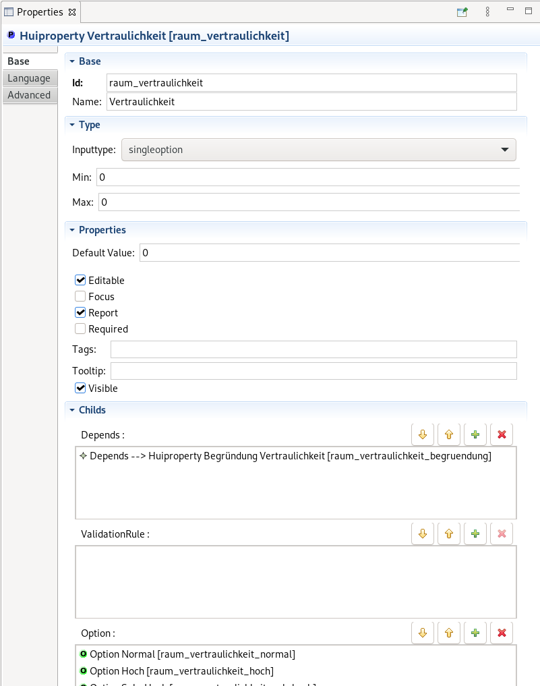

# SNCA Editor

The snca editor is an emf based editor to edit, verify and document the snca description of the ISMS verinice. see https://github.com/SerNet/verinice

## basic usage

The snca editor can be started as a gui program to edit the snca.xml together with the language files, and also used as a commandline tool. As we do not provide binaries you will need to build it your self. See build for further details.

### as editor

Start the program snca-editor. Create a project, import a snca.xml file.  
Start editing the file or generating documentation. Export the snca file back to the raw xml.

Import a snca file with the Import > Import SNCA XML File Action  
  

Navigate the SNCA structure  
  

#### edit Property Groups

Edit property groups  
 

#### edit properties

Edit properties  
 

#### edit relation

Edit relations  
 

#### export to snca.xml

Select the snca.hito file in the project tree and use File > Export > Export SNCA
 

### as commandline tool

To use the snca-editor as part of your tool chain, you can access various functions as commandline tool.

./snca-editor  -application de.sernet.eclipse.hui.commandline.commandlinerunner -data YOUR_WS  -i <the snca.xml> [action switches -generateMarkdown -generateWiki -export -validate <INFO|WARNING|ERROR> ]

for example after building with maven (see down there):

> cd snca-editor  

> de.sernet.eclipse.hui.product/target/products/de.sernet.eclipse.hui.product/linux/gtk/x86_64/snca-editor/snca-editor  -application de.sernet.eclipse.hui.commandline.commandlinerunner -data YOUR_WS -i build/rcptt/test-data/SNCA.xml -h

Prints the snca commandline tool help.

> de.sernet.eclipse.hui.product/target/products/de.sernet.eclipse.hui.product/linux/gtk/x86_64/snca-editor/snca-editor  -application de.sernet.eclipse.hui.commandline.commandlinerunner -data YOUR_WS -i build/rcptt/test-data/SNCA.xml -generateWiki  

Will import the SNCA used for Automatic testing to produce a wiki based documentation. This will generate dot file for te relation with need further processing by the dot program.

> de.sernet.eclipse.hui.product/target/products/de.sernet.eclipse.hui.product/linux/gtk/x86_64/snca-editor/snca-editor  -application de.sernet.eclipse.hui.commandline.commandlinerunner -data YOUR_WS -i build/rcptt/test-data/SNCA.xml -validate INFO

Validate the SNCA agaist the enabled ruleset and systout the result.

The options can be combined: 

* generateMarkdown - generates a markdown file together with dot files for each entity, the dot file need post processing by the dot program
* generateWiki - same as markdown but in wiki syntax, use markdown and pandoc for transforming
* validate - validate the snca against the defined rules and print the findings to sysout

## build

The SCNA Editor is build with tycho and maven

> git clone xxxx  
> cd snca-editor  
> mvn clean verify  

which build the product for win, mac and linux 
and can be found at  __/de.sernet.eclipse.hui.product/target/products__

### development

To setup and checkout the code, use the eclipse installer and the [snca-editor-workspace.setup](https://raw.githubusercontent.com/UrsZeidler/snca-editor/master/de.sernet.eclipse.hui.parent/build/etc/ide/snca-editor-workspace.setup) Oohmp setup, which will install and configure a eclipse installation, and checkout the code and import it.

* download the [installer](https://wiki.eclipse.org/Eclipse_Installer), get the setup file and install.  
Switch to advanced mode. On the first page (product selection), choose whatever product your eclipse should be based upon. On the second page, you can drag your SimYardSale.setup file from the system explorer onto the “eclipse.org” top node. Double click it, so that it is shown in the three lists below.

